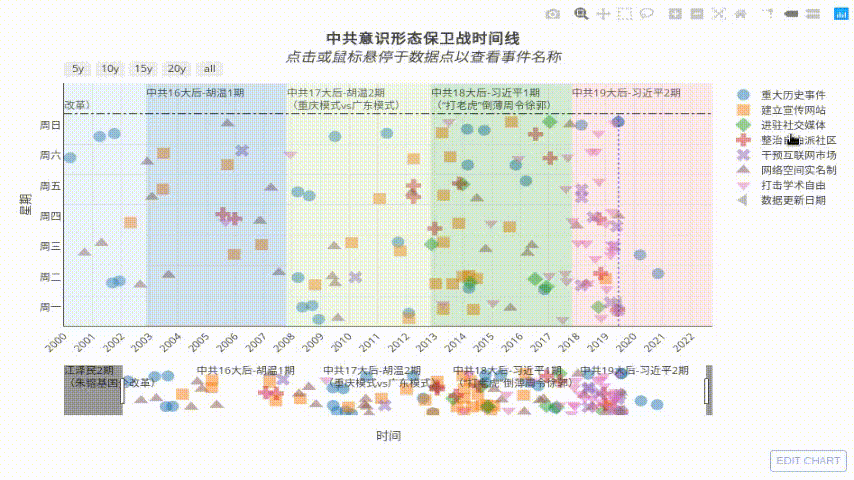

# Timeline Data

最新时间线互动图 [https://chinatimeline.github.io/](https://chinatimeline.github.io/)

<!---->


**参与：**

Redditer可直接前往[r/chinatimeline](https://old.reddit.com/r/chinatimeline/)提交新闻，可以是link或者自己写的文档，最好带上相关链接。

也可提交PR (Pull Request)添加事件，此外如果你希望创建新的图，可通过PR添加新的文件夹和csv格式数据文件
1. 5分钟了解PR工作流程:
    * 中文视频(陆)： [泊学-在GitHub创建和处理PR](https://boxueio.com/series/git-essential/episode/459), [油管Inty](https://www.youtube.com/watch?v=MBdLOl5tUKY)
    * [中文视频(台)](https://www.youtube.com/watch?v=pytolws6aiE)
    * [文字教程：尝试Pull Request](https://www.jianshu.com/p/dd243fecf0f4) [档案版](https://archive.fo/NZmPb)
    * [English Video Tutorial](https://www.youtube.com/watch?v=rgbCcBNZcdQ)
    * [About pull requests](https://help.github.com/en/articles/about-pull-requests)
2. 为避免被喝茶，请用与真实身份脱钩的github帐号
    * 墙内请用VPN+Tor访问: (1)如用本地目录请用[双虚拟机方案](https://program-think.blogspot.com/2013/11/tor-faq.html?m=1), (2)如仅网页编辑请用[Tor Browser](https://www.torproject.org/download/)
    * Github接受的匿名邮箱 [Protonmail](https://protonmail.com), [Tutanota](https://www.tutanota.com). 注册虚拟手机号 [TextNow](https://www.textnow.com)

## 1 目录结构与说明
```bash
├── README.md #本文件 数据仓库说明文档
├── ideology #中共意识形态保卫战
│   ├── CCP_Ideology_Timeline.json #从CPC Brainwashing Timeline导出的原始数据（停用）
│   ├── CCP_Ideology_Events.csv #事件数据文件
│   ├── CCP_Religious_Persecution.csv #迫害宗教自由数据文件
│   └── CCP_Presidential_term.csv #中共中央总书记任期（图中背景区块）
├── OneBeltOneRoad # 一带一路
│   ├── CCP_Presidential_term.csv #中共中央总书记任期（图中背景区块）
│   └── OBOR_Events.csv # 一带一路相关事件
└── US_CN_TradeWar #美中贸易战
    ├── Persidential_Term.csv #美中领导人任期（图中背景区块）
    └── TradeWar_Events.csv #贸易战相关事件数据文件
```
### 1.1 数据格式说明
数据文件可在浏览器中直接编辑，也在你电脑上用Excel, OpenOffice, 或任何文本编辑器中编辑。

格式说明如下：
* date表示事件发生日期，可以是被报道日或报道中提及准确日期。
* name为事件标题，鼠标略过对应的点时会显示出来，标题请尽量简略准确。
* group为事件类型，名称会显示在图例中，详见[数据信息](#ideologicalwar)。
* impact为影响因子，取值{0,1,2,3,4,5}，决定事件点的大小，推荐值如下，5：经媒体报道的事件，4：政策征询，1：网友个人遭遇（如被喝茶）未经媒体广泛报道的爆料。
* description为可选的事件描述，一般为相关新闻链接或存档地址，不在图中显示。


| date | name | group | impact | description |
|---|---|---|---|---|
| 2014-10-15| 习近平主持召开文艺工作座谈会 | 网络空间实名制 | 5 | 新闻存档 https://archive.li/tDTZd |
| 2018-02-27| 苹果中国iCloud转交“云上贵州”运营 | 干预互联网市场| 5 | null |

文本编辑器(推荐sublime text, atom, notepad++等)中显示为
```text
date,name,group,impact,description,
2014-10-15,习近平主持召开文艺工作座谈会,网络空间实名制,5,新闻存档 https://archive.li/tDTZd
2018-02-27,苹果中国iCloud转交“云上贵州”运营,干预互联网市场,5,
```

注意：`,`必须是英文字符而非中文字符`，`如需在标题中使用英文字符`,`则须在内容加英文字符双引号`"xxx"`否则会出错，如：
```text
"2009-06-02","Twitter,Bing等微软服务被墙","网络空间实名制","5","http://www.chinagfw.org/2010/02/gfw_4590.html"
2018-02-27,苹果中国iCloud转交“云上贵州”运营,干预互联网市场,5,
```
所以应尽量避免标题出现英文字符`,`

### 1.2 数据信息
#### 1.2.1 文件夹 ideology<a name="ideologicalwar"></a>

中共为控制意识形态采取的各种措施及相关报道，分类如下（欢迎对分类提意见）：
1. 重大历史事件：具有标志性或里程碑意义、对历史产生重大影响的国内外政治或军事事件
2. 文化文艺娱乐：在文学、艺术、影视、游戏以及一般文化方面，基于意识形态理由的审查、引导等
3. 数字监控与墙~~网络空间实名制~~：如GFW、各类实名制的政策与法律、黑客攻击、金盾工程、天网工程、雪亮工程，拘留喝茶翻墙网友等
4. 建立宣传网站：各种宣传中共意识形态的极左网站、论坛、纪录片等
5. 进驻社交媒体：官方机构开设社交媒体帐号进驻各种互联网平台
6. 整治自由派社群：官方对自由派媒体、论坛、意见领袖的各种打压行动
7. 打击学术自由：针对学生、高校教师在高校环境内的迫害、洗脑、打压、处罚、审查、告密等
8. 干预互联网市场：以行政为主技术为辅的手段对互联网公司的运营进行插手、干扰、处罚等
9. 党团人事组织：标志性的党、团人事或组织变动事件、政策等
10. (单列)宗教迫害：为防止宗教思想传播而迫害宗教人士、群体、族群，审查和篡改宗教相关课文、书籍等

数据来源
1. 本数据初版来自“中共洗脑保党时间线” [https://time.graphics/line/226382](https://time.graphics/line/226382)
  >
2. GFW的前世今生 [阅后即焚 (archive)](https://web.archive.org/web/20170923114736/http://www.chinagfw.org/2009/08/gfw_30.html)
3. 宗教迫害： [中华民国大陆委员会大陆地区人权状况](https://www.mac.gov.tw/np.asp?ctNode=7351&mp=1), [陆委会大陆地区宗教迫害状况2000-2006](https://www.mac.gov.tw/cn/cp.aspx?n=DD102593FDB1A032)

#### 1.2.2 文件夹 US_CN_TradeWar

数据源: [The US China Trade War: A Timeline](https://www.china-briefing.com/news/the-us-china-trade-war-a-timeline/)

参考 [Bloomberg](https://www.bloomberg.com/news/articles/2019-01-30/u-s-china-trade-war-timeline-what-s-happened-and-what-s-next)

#### 1.2.3 文件夹 OneBeltOneRoad
数据源: [新华网](http://www.xinhuanet.com/world/2019-04/26/c_1124418156.htm)

参考: [World Bank: Belt and Road Initiative](https://www.worldbank.org/en/topic/regional-integration/brief/belt-and-road-initiative)

## 参考新闻源
* 搜索引擎 [Google](https://google.com), [Startpage.com](https://startpage.com), [DuckDuckGo](https://duckduckgo.com/)
* [中国数字时代](https://chinadigitaltimes.net/chinese/)
* wikipedia的中国历史年表:[2008](https://zh.wikipedia.org/wiki/2008%E5%B9%B4%E4%B8%AD%E5%9B%BD%E5%A4%A7%E9%99%86),[2009](https://zh.wikipedia.org/wiki/2009%E5%B9%B4%E4%B8%AD%E5%9B%BD),[2010](https://zh.wikipedia.org/wiki/2010%E5%B9%B4%E4%B8%AD%E5%9C%8B),[2011](https://zh.wikipedia.org/wiki/2011%E5%B9%B4%E4%B8%AD%E5%9B%BD%E5%A4%A7%E9%99%86),[2012](https://zh.wikipedia.org/wiki/2012%E5%B9%B4%E4%B8%AD%E5%9C%8B),[2013](https://zh.wikipedia.org/wiki/2013%E5%B9%B4%E4%B8%AD%E5%9B%BD),[2014](https://zh.wikipedia.org/wiki/2014%E5%B9%B4%E4%B8%AD%E5%9C%8B),[2015](https://zh.wikipedia.org/wiki/2015%E5%B9%B4%E4%B8%AD%E5%9C%8B),[2016](https://zh.wikipedia.org/wiki/2016%E5%B9%B4%E4%B8%AD%E5%9B%BD),[2017](https://zh.wikipedia.org/wiki/2017%E5%B9%B4%E4%B8%AD%E5%9B%BD),[2018](https://zh.wikipedia.org/wiki/2018%E5%B9%B4%E4%B8%AD%E5%9B%BD)
* 西方各大媒体
* 中国官媒，政府网站
* 宗教迫害：中华民国陆委会 [迫害宗教自由事例 2000-2006](https://www.mac.gov.tw/cn/cp.aspx?n=DD102593FDB1A032), [大陆人权概况专区](https://www.mac.gov.tw/np.asp?ctNode=7351&mp=1)

### 工具
* 转换PDF为CSV [https://www.zamzar.com/](https://www.zamzar.com/)

---
[MIT License](https://opensource.org/licenses/MIT) |
Update: 2019-06-26
